# Prak2_Probstat2023_C_502521128

| NAMA | NRP | KELAS |
|--------|--------|:------:|
|Muhammad Rifqi Fadhilah|5025211228|C|

## Nomor 1
Seorang peneliti melakukan penelitian mengenai pengaruh aktivitas 𝐴 terhadap
kadar saturasi oksigen pada manusia. Peneliti tersebut mengambil sampel
sebanyak 9 responden. Pertama, sebelum melakukan aktivitas 𝐴, peneliti mencatat
kadar saturasi oksigen dari 9 responden tersebut. Kemudian, 9 responden tersebut
diminta melakukan aktivitas 𝐴. Setelah 15 menit, peneliti tersebut mencatat
kembali kadar saturasi oksigen dari 9 responden tersebut. Berikut data dari 9
responden mengenai kadar saturasi oksigen sebelum dan sesudah melakukan
aktivitas.

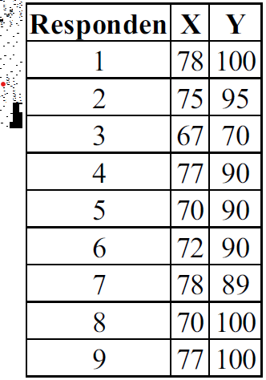

Berdasarkan data pada tabel diatas, diketahui kadar saturasi oksigen dari
responden ke-3 ketika belum melakukan aktivitas 𝐴 sebanyak 67, dan setelah
melakukan aktivitas 𝐴 sebanyak 70.

### 1a

Carilah Standar deviasi dari data selisih pasangan pengamatan tabel diatas

Jawab:
```
X <- c(78, 75, 67, 77, 70, 72, 78, 70, 77)
Y <- c(100, 95, 70, 90, 90, 90, 89, 100, 100)

sd(Y - X)
```
Kita perlu menyimpan data percobaan tersebut ke dalam variabel X dan Y. Setelah itu, kita dapat menggunakan fungsi sd(Y - X) untuk menghitung standar deviasi dari data tersebut.

Output:

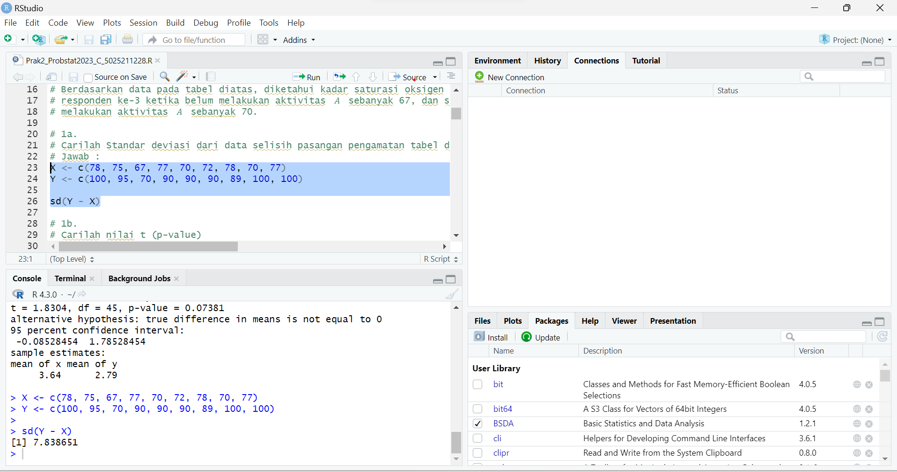

### 1b

Carilah nilai t (p-value)

Jawab:
```
X <- c(78, 75, 67, 77, 70, 72, 78, 70, 77)
Y <- c(100, 95, 70, 90, 90, 90, 89, 100, 100)

t.test(Y, X, paired = TRUE)
```
Dengan menggunakan fungsi t.test(), kita dapat menghasilkan ringkasan uji statistik. Dari hasil tersebut, diperoleh nilai t (p-value) sebesar 0.0001373

Output:

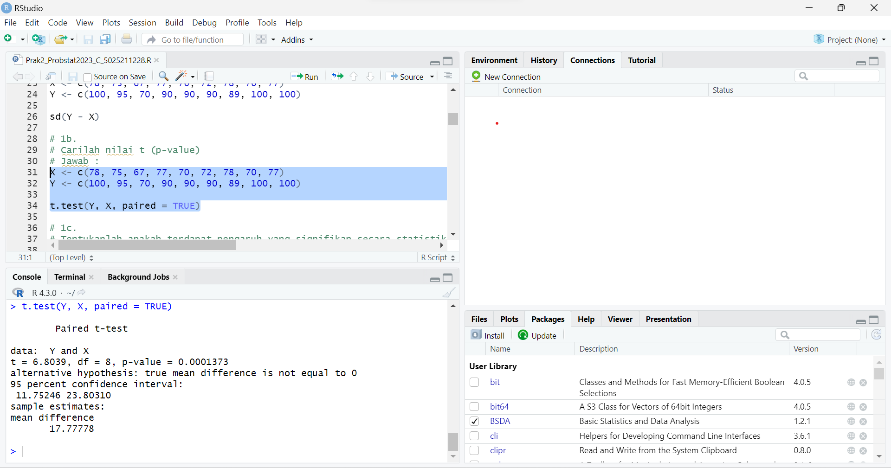

### 1c
Tentukanlah apakah terdapat pengaruh yang signifikan secara statistika dalam
hal kadar saturasi oksigen , sebelum dan sesudah melakukan aktivitas 𝐴 jika
diketahui tingkat signifikansi 𝛼 = 5% serta H0 : “tidak ada pengaruh yang
signifikan secara statistika dalam hal kadar saturasi oksigen sebelum dan sesudah
melakukan aktivitas 𝐴”.

Jawab:

```
X <- c(78, 75, 67, 77, 70, 72, 78, 70, 77)
Y <- c(100, 95, 70, 90, 90, 90, 89, 100, 100)
alfa <- 0.05

t_test_result <- t.test(Y, X, paired = TRUE)

if (t_test_result$p.value <= alfa) {
  print("H0 Ditolak, terdapat pengaruh yang signifikan secara statistika dalam hal kadar saturasi oksigen sebelum dan sesudah melakukan aktifitas A")
} else {
  print("H0 diterima, tidak ada pengaruh yang signifikan secara statistika dalam hal kadar saturasi oksigen sebelum dan sesudah melakukan aktifitas A")
}

```
Untuk menentukan apakah H0 ditolak atau tidak, kita dapat menggunakan fungsi t.test(). Jika nilai p-value lebih kecil dari alpha atau berada dalam daerah penolakan, maka H0 ditolak. Dalam output sebenarnya dari fungsi t.test(), kita bisa langsung mendapatkan kesimpulan hipotesis dengan menggunakan beberapa parameter. Namun, dalam kasus ini, kita membandingkan nilai p-value secara manual dengan alpha. Dari output, terlihat bahwa H0 ditolak, yang berarti terdapat pengaruh yang signifikan secara statistik dalam hal kadar saturasi oksigen sebelum dan sesudah melakukan aktivitas A.

Output:
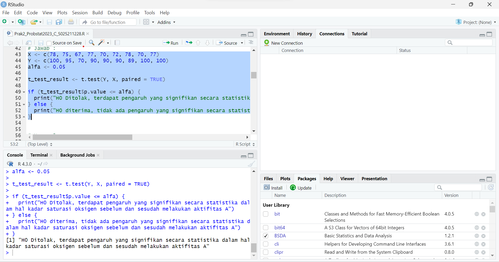

## Nomor 2
Diketahui bahwa mobil dikemudikan rata-rata lebih dari 25.000 kilometer per
tahun. Untuk menguji klaim ini, 100 pemilik mobil yang dipilih secara acak
diminta untuk mencatat jarak yang mereka tempuh. Jika sampel acak
menunjukkan rata-rata 23.500 kilometer dan standar deviasi 3.000 kilometer
(kerjakan menggunakan library seperti referensi pada modul).

### 2a
Apakah Anda setuju dengan klaim tersebut? Jelaskan.

Jawab:

```
Saya tidak setuju. Meskipun ada kemungkinan 25.000, namun rata-rata sampel yang didapatkan adalah 23.500 dengan standar deviasi 3.000, sehingga data cenderung berkumpul di sekitar 23.500
```

### 2b
Buatlah kesimpulan berdasarkan p-value yang dihasilkan!

Jawab:
```
install.packages("BSDA")
library(BSDA)

tsum.test(mean.x = 23500, s.x = 3000, n.x = 100, conf.level = 0.95, mu = 25000)
```

Output:
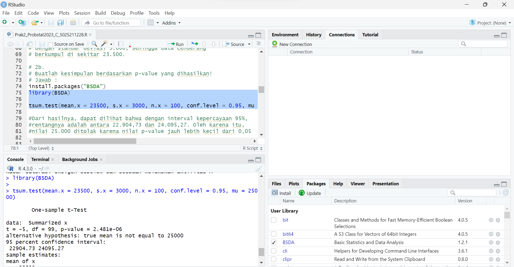

## Nomor 3
Diketahui perusahaan memiliki seorang data analyst yang ingin memecahkan
permasalahan pengambilan keputusan dalam perusahaan tersebut. Selanjutnya
didapatkanlah data berikut dari perusahaan saham tersebut.

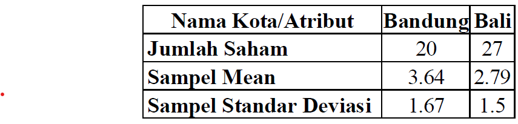

Dari data di atas berilah keputusan serta kesimpulan yang didapatkan. Asumsikan
nilai variancenya sama, apakah ada perbedaan pada rata-ratanya (α= 0.05)?
Buatlah:

### 3a
H0 dan H1

Jawab:

```
H0 : mean1 = mean2
H1 : mean1 != mean2
```

### 3b
Hitung sampel statistik

```
install.packages("BSDA")
library(BSDA)

tsum.test(mean.x=3.64, s.x = 1.67, n.x = 20, mean.y =2.79 , s.y = 1.5, n.y = 27, alternative = "two.sided", var.equal = TRUE)
```

Dengan menggunakan fungsi tsum.test(), kita memperoleh ringkasan statistik dari kedua data yang ingin diuji. Kita menentukan argumen alternatif sebagai "two.sided" karena kita ingin membuktikan bahwa kedua data memiliki mean yang berbeda dalam kedua arah. Terakhir, karena kita mengasumsikan bahwa variance kedua data sama, kita mengatur var.equal = true. Hasil uji statistik dapat dilihat pada output.

Output:
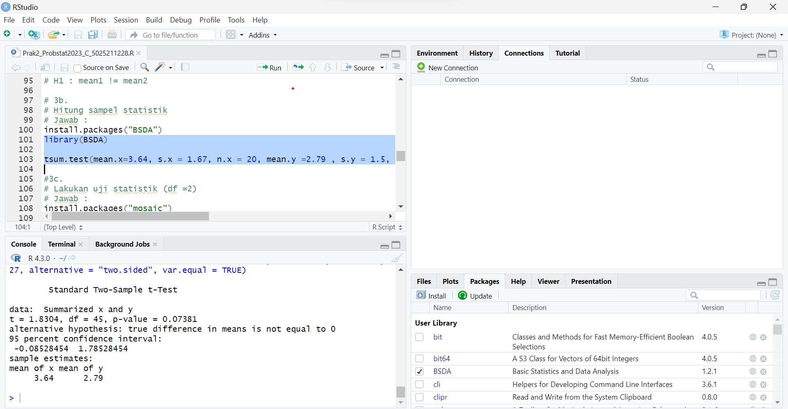

### 3c
Lakukan uji statistik (df =2)

```
install.packages("mosaic")
library(mosaic)

plotDist(dist = 't', df = 2, col = "blue")
```

Untuk uji statistik, kita hanya akan menggunakan plot dist dengan df = 2 untuk melihat distribusinya

Output:
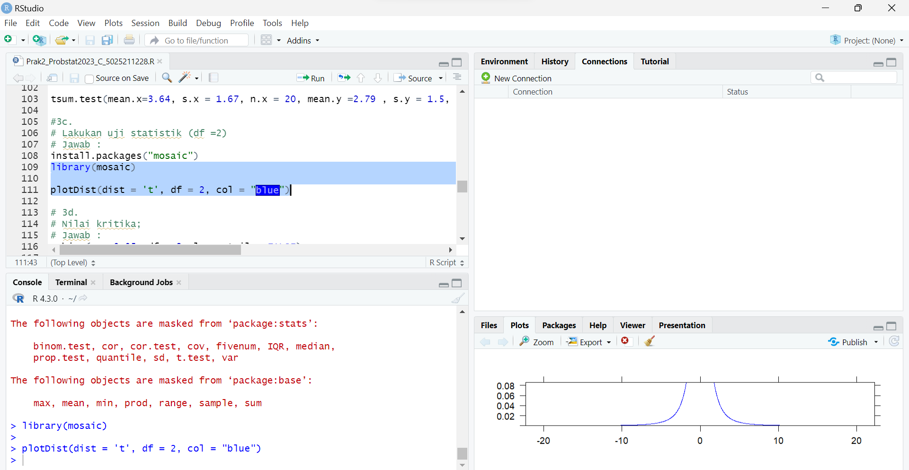

### 3d
Nilai kritikal

Jawab
```
qchisq(p = 0.05, df = 2, lower.tail = FALSE)
```

dengan menggunakan qchisq() dari df=2 dan confidence lefel = 95%, didapat nilai kritikal yaitu 5.991465

Output:

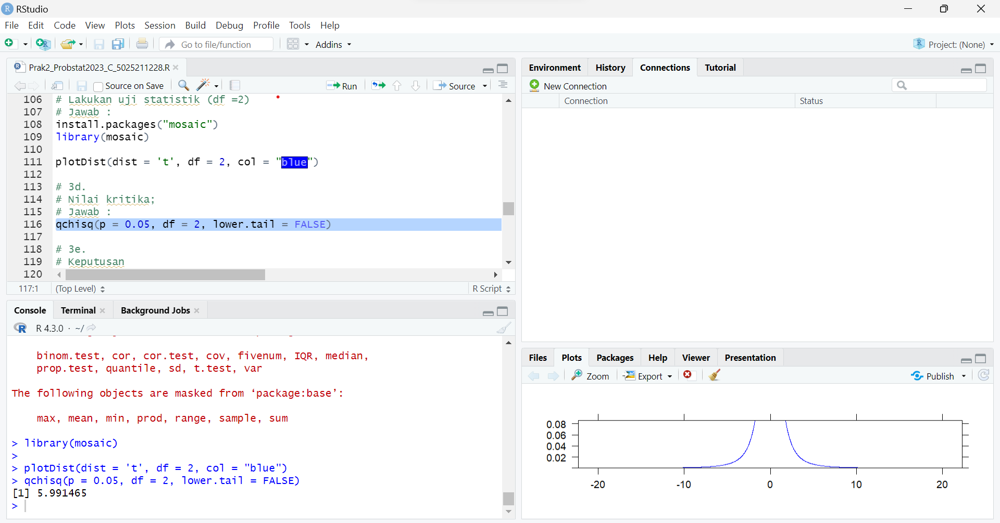

### 3e
Keputusan

Jawab:
```
Keputusan didapatkan dari hasil tsum.test()
```

### 3f

Kesimpulan

Jawab:
```
H0 ditolak, menunjukkan bahwa terdapat perbedaan rata-rata antara kedua set data tersebut. Oleh karena itu, H1 diterima
```
## Nomor 4
Data yang digunakan merupakan hasil eksperimen yang dilakukan untuk mengetahui pengaruh suhu operasi (100˚C, 125˚C dan 150˚C) dan tiga jenis kaca pelat muka (A, B dan C) pada keluaran cahaya tabung osiloskop. Percobaan dilakukan sebanyak 27 kali dan didapat data sebagai berikut: https://drive.google.com/file/d/1pICtCrf61DRU86LDPQDJmcKiUMVt9ht4/view. 

Dengan data tersebut:
### 4a
Buatlah plot sederhana untuk visualisasi data.

Jawab:
Pertama kita harus membaca file csv nya dengan read.csv(), lalu kita tinngal membuat plot dengan qplot() untuk masing masing jenis kaca

```
data <- read.csv("C:\\Users\\M. Rifqi Fadhilah\\OneDrive\\Dokumen\\coding\\Semester 4\\Probstat\\Prak2_Probstat2023_C_502521128\\GTL.csv")
qplot(x = Temp, y = Light, geom = "point", data = data) + facet_grid(.~Glass, labeller = label_both)
```
Output:

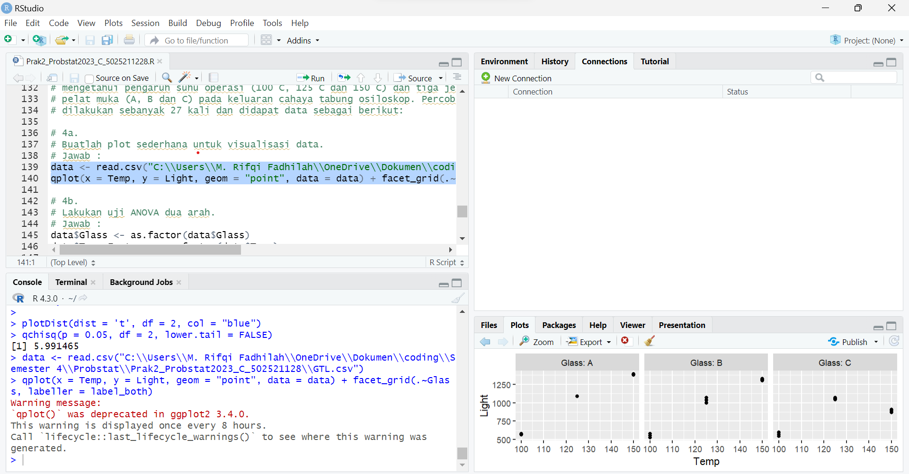

### 4b
Lakukan uji ANOVA dua arah.

Jawab:
```
data$Glass <- as.factor(data$Glass)
data$Temp_Factor <- as.factor(data$Temp)

anova_model <- aov(Light ~ Glass * Temp_Factor, data = data)
anova_summary <- summary(anova_model)

anova_summary
```

Output:

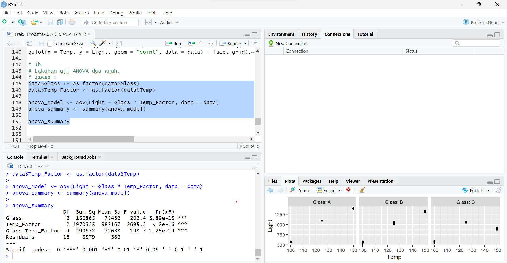

### 4c

Tampilkan tabel dengan mean dan standar deviasi keluaran cahaya untuk setiap perlakuan (kombinasi kaca pelat muka dan suhu operasi).

jawab:

```
summary <- data %>%
  group_by(Glass, Temp) %>%
  summarise(mean = mean(Light), sd = sd(Light)) %>%
  arrange(desc(mean))

summary
```

Output:

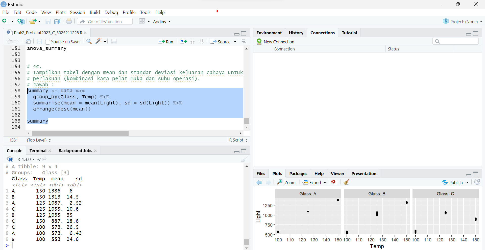